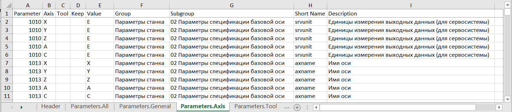
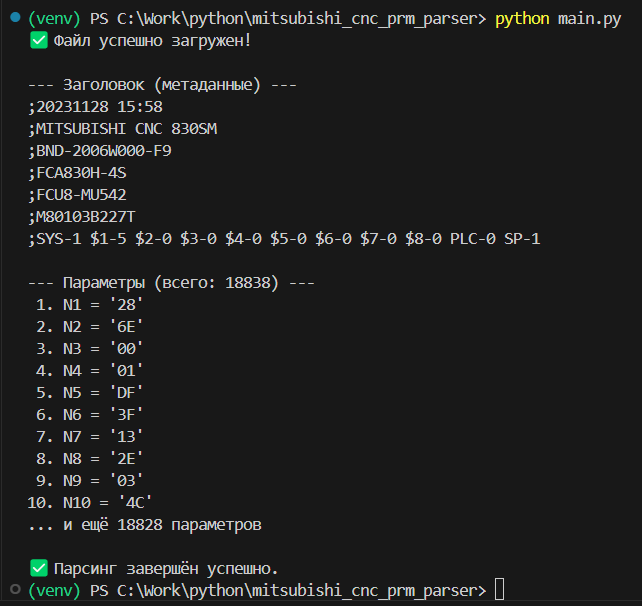

# Mitsubishi CNC ALL.PRM Parser



Инструмент для **инженеров и наладчиков** ЧПУ Mitsubishi серии **M800**, позволяющий:

- Преобразовать файл бэкапа `ALL.PRM` в удобный **Excel-документ**
- Автоматически подставлять **описания параметров** из справочника
- Отображать оси как **X, Y, Z, A, C** вместо `A1, A2, A3...`
- Подготавливать данные для последующего **сравнения версий** (в будущем)

> 💡 Нет необходимости быть программистом — достаточно базовых навыков работы с командной строкой.

---

## 🚀 Быстрый старт

### 1. Установите Python
- Скачайте и установите **Python 3.8 или новее** с [официального сайта](https://www.python.org/downloads/)
- При установке **обязательно отметьте** галочку **"Add Python to PATH"**

### 2. Подготовьте окружение
Откройте **Командную строку (cmd)** или **PowerShell** и выполните:

```bash
# Перейдите в папку проекта
cd путь/к/mitsubishi_cnc_prm_parser

# Создайте виртуальное окружение
python -m venv venv

# Активируйте его
# Windows (PowerShell):
.\venv\Scripts\Activate.ps1
# Windows (cmd):
venv\Scripts\activate.bat
# Linux/macOS:
source venv/bin/activate
```

### 3. Установите зависимости (библиотеки)
```bash
pip install -r requirements.txt
```

> 📝 Файл `requirements.txt` уже содержит всё необходимое: библиотеки `openpyxl` и `PyYAML`.

### 4. Подготовьте входные файлы
- Поместите ваш файл `ALL.PRM` (снятый с ЧПУ) в папку проекта
- (Опционально) добавьте `descriptions.yaml` с описаниями параметров или воспользуйтесь тем что есть в проекте

## 🛠 Примеры использования

### Базовый парсинг (вывод в консоль)

```bash
python main.py
# Ищет ALL.PRM и descriptions.yaml автоматически
```



### Экспорт в Excel

```bash
# Используя ALL.PRM из текущей папки
python main.py -o output.xlsx

# Указать файл параметрами явно
python main.py backup.PRM -o report.xlsx
```

> Если всё хорошо увидите сообщение: `✅ Экспорт в Excel завершён: output.xlsx`

### С поддержкой описаний параметров

```bash
# Автоматически загрузит descriptions.yaml
python main.py ALL.PRM -o full_report.xlsx

# Использовать свой справочник my_params.yaml
python main.py ALL.PRM -o report.xlsx --descriptions my_params.yaml
```

### С отображением имён осей (X, Y, Z вместо A1, A2, A3)

```bash
# Добавьте аргумент --axis-names
python main.py ALL.PRM -o with_axis_names.xlsx --axis-names
```

> 🔍 Имена осей берутся из **самого файла ALL.PRM**, из параметра **1013Ax** (например, `N1013A1PX` → ось `A1 = X`) 

### 🆚 Сравнение двух файлов параметров (diff)

С помощью утилиты `diff.py` вы можете **сравнить два файла** `ALL.PRM` (например, до и после наладки) и получить **Excel-отчёт с различиями**.

#### Простое сравнение

```bash
python diff.py backup_old.PRM backup_new.PRM
```
Результат сохраняется в файл `diff.xlsx` (имя файла по умолчанию).

#### Сравнение с указанием имени отчёта

```bash
python diff.py v1.PRM v2.PRM -o сравнение_наладки.xlsx
```

#### Сравнение с поддержкой описаний и имён осей

Если у вас есть файл `descriptions.yaml` и вы хотите видеть **описания параметров** и **оси как X/Y/Z**, используйте:

```bash
python diff.py old.PRM new.PRM -o report.xlsx --descriptions descriptions.yaml --axis-names
```

> 💡 Файл `descriptions.yaml` ищется автоматически в текущей папке, если не указан явно через `--descriptions`. 

#### Что показывает `diff.xlsx`
- **Зелёные строки** — параметры, **добавленные** в новом файле.
- **Красные строки** — параметры, **удалённые** из нового файла.
- **Обычные строки** — параметры, **значение которых изменилось**.
- Колонки:
`Parameter`, `Axis`, `Tool`, `Keep`, `Value (old)`, `Value (new)`, `Changed`, `Description`


## 📊 Возможности проекта

### ✅ Уже реализовано

| Функция | Статус |
| --- | --- |
| Парсинг `ALL.PRM` | ✅ |
| Экспорт в **Excel** с закреплённой шапкой | ✅ |
| Разделение параметров по листам: General, Axis, Tool, Keep | ✅ |
| Поддержка `--axis-names` (X/Y/Z вместо A1/A2/A3) | ✅ |
| Подключение справочника `descriptions.yaml` | ✅ |
| Валидация формата справочника и корректная обработка ошибок | ✅ |
| Сравнение двух `ALL.PRM` файлов (**diff**-утилита) | ✅ |

## ⏳ Планируется

| Функция | Статус |
| --- | --- |
| Полноценная документация `README.md` | ✅ (вы её читаете) |

## 📁 Формат справочника `descriptions.yaml`

```yaml
1001:
  group: "Параметры станка"
  subgroup: "01 Базовые системные параметры"
  shortname: "SYS_ON"
  description: "Настройка проверки системы"
1013:
  group: "Параметры станка"
  subgroup: "02 Параметры спецификации базовой оси"
  shortname: "axname"
  description: "Имя оси"
```

> 💡 Вы можете начать с нескольких строк и постепенно дополнять справочник. 

## 📎 Лицензия
Проект распространяется по лицензии **MIT** — вы можете свободно использовать его в личных и коммерческих целях.

> 🔧 **Совет**: если вы работаете с несколькими станками — создайте отдельную папку для каждого, чтобы не путать `ALL.PRM` и `descriptions.yaml`. 


## 📥 Как скачать проект с GitHub (без Git)
1. Перейдите на страницу репозитория: 👉 https://github.com/GerSmith/mitsubishi_cnc_prm_parser
2. Нажмите зелёную кнопку `Code` → `Download ZIP`
3. Распакуйте архив в удобную папку
4. Запустите парсер, как описано выше
